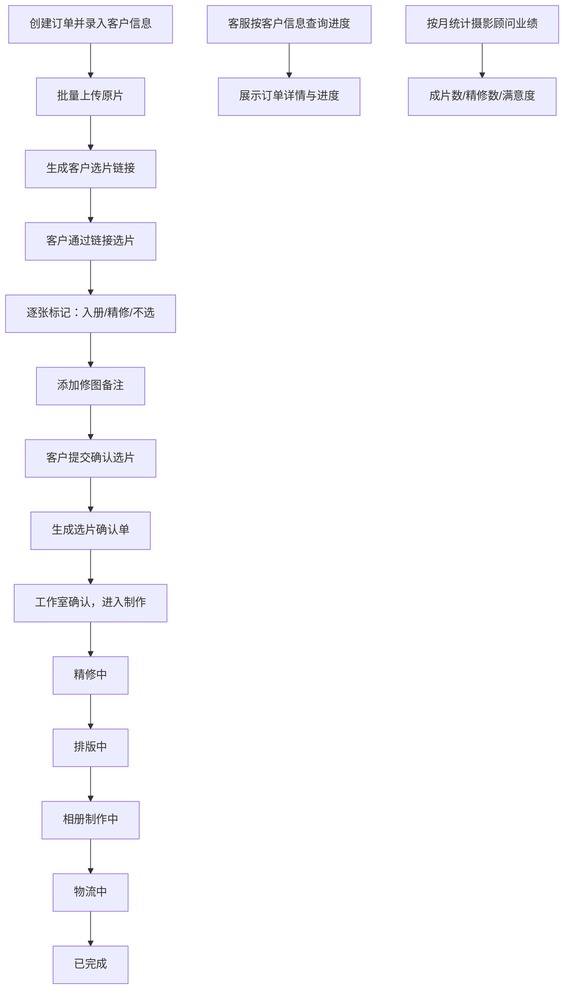

## 1. 产品概述

面向小型婚纱摄影工作室的客户选片与产品制作进度跟踪工具。解决摄影工作室从原片上传、客户选片、选片确认到制作进度跟踪的全流程管理痛点，提升工作室运营效率与客户体验。

- 目标用户：婚纱摄影工作室的客服人员、摄影顾问、制作团队以及终端客户
- 核心价值：打通选片-制作全链路，减少沟通成本，实时掌握订单进度，数据化统计顾问业绩

## 2. 核心功能

### 2.1 用户角色

| 角色 | 说明 | 核心权限 |
|------|------|----------|
| 工作室管理员 | 工作室内部工作人员 | 全功能访问：上传照片、生成选片链接、查看所有订单、更新进度、查看统计 |
| 摄影顾问 | 负责拍摄及客户对接 | 查看自己客户的订单、查看自己的业绩统计 |
| 客户 | 拍摄婚纱照的顾客 | 通过专属链接选片、查看自己订单的制作进度 |

### 2.2 功能模块

1. **工作台首页**：订单概览、快捷操作入口、待处理事项提醒
2. **订单管理**：创建订单、客户信息录入、照片批量上传、生成选片链接
3. **客户选片页**：照片浏览、标记"入册/精修/不选"、添加备注、提交确认
4. **选片确认单**：展示选片结果、精修需求汇总、支持打印/导出
5. **制作进度跟踪**：5个状态流转（精修中→排版中→相册制作中→物流中→已完成），自动记录时间节点
6. **客服查询**：按客户姓名/手机号/订单号搜索订单进度
7. **统计报表**：按摄影顾问统计每月成片数、精修张数、满意度评分均值

### 2.3 页面详情

| 页面名称 | 模块名称 | 功能描述 |
|----------|----------|----------|
| 工作台 | 数据概览卡片 | 显示进行中订单数、待选片订单数、本月完成订单数 |
| 工作台 | 快捷入口 | 新建订单、批量上传、查看进度统计 |
| 工作台 | 最近动态 | 近期订单状态变更流水 |
| 订单列表 | 筛选搜索 | 按状态/日期/摄影顾问筛选、关键词搜索 |
| 订单列表 | 订单卡片 | 展示客户信息、状态标签、进度百分比 |
| 新建订单 | 基础信息 | 客户姓名、手机、摄影顾问、拍摄日期、套餐信息 |
| 新建订单 | 照片上传 | 拖拽/点击批量上传原片、上传进度显示、删除单张 |
| 新建订单 | 生成链接 | 生成客户专属选片链接，支持复制 |
| 客户选片页 | 照片画廊 | 网格布局展示照片，支持放大预览 |
| 客户选片页 | 标记操作 | 每张照片快捷标记：入册、精修、不选 |
| 客户选片页 | 备注输入 | 为单张照片添加修图备注 |
| 客户选片页 | 统计面板 | 实时显示已选数量、入册/精修计数 |
| 客户选片页 | 提交确认 | 确认提交选片结果，不可再修改 |
| 选片确认单 | 结果展示 | 客户信息、选片统计、照片缩略图及标记 |
| 选片确认单 | 备注汇总 | 所有精修照片的备注汇总列表 |
| 选片确认单 | 操作按钮 | 打印、导出PDF、确认并进入制作 |
| 制作进度 | 状态时间线 | 5个状态节点的流转时间展示 |
| 制作进度 | 状态更新 | 手动切换下一状态，自动记录时间 |
| 制作进度 | 物流信息 | 物流中状态下填写快递单号和物流公司 |
| 进度查询 | 搜索框 | 按客户姓名/手机号/订单号搜索 |
| 进度查询 | 结果展示 | 匹配订单的详细进度和客户信息 |
| 统计报表 | 时间筛选 | 按月份筛选统计周期 |
| 统计报表 | 顾问排行表格 | 展示摄影顾问：成片数、精修张数、满意度均值 |
| 统计报表 | 趋势图表 | 月度完成订单数趋势图 |

## 3. 核心流程

### 主要业务流程

工作室管理员创建订单并录入客户和套餐信息 → 批量上传所有原片 → 系统生成客户专属选片链接 → 客服将链接发送给客户 → 客户打开链接浏览照片并逐张标记（入册/精修/不选），可添加修图备注 → 客户确认提交选片 → 系统自动生成选片确认单 → 工作室确认选片结果，订单进入制作流程 → 制作团队按状态流转（精修中→排版中→相册制作中→物流中→已完成），每个状态变更自动记录时间 → 客户可随时通过链接查看制作进度 → 客服可按客户信息搜索查询进度 → 系统按月统计摄影顾问的业绩数据

## 4. 用户界面设计

### 4.1 设计风格

**整体调性：典雅浪漫 · 精致奢华**

契合婚纱摄影行业的浪漫属性，采用暖调优雅的设计语言：

- **主色**：香槟金 `#C9A961` — 象征婚礼的神圣与精致
- **辅助色**：柔玫瑰粉 `#E8C4C4`、象牙白 `#FAF6F1`
- **中性色**：墨炭灰 `#2D2A26`、暖灰 `#6B6560`、米白 `#F5F0EA`
- **按钮样式**：圆角矩形（r-8），主按钮为香槟金渐变，悬停时微上浮 + 柔光阴影
- **字体**：
  - 标题：Playfair Display 衬线字体，体现优雅品味
  - 正文：Noto Sans SC 思源黑体，保证中文可读性
  - 数字：DM Mono 等宽字体，数据展示清晰
- **布局风格**：卡片式布局，大留白，柔和圆角（r-12 ~ r-16），细腻柔光阴影
- **图标风格**：使用 lucide-react 线性图标，统一描边宽度 1.5px
- **装饰细节**：微妙的暗金色纹理背景、细金线分隔、柔和的渐变光晕

### 4.2 页面设计概览

| 页面名称 | 模块名称 | UI 元素设计 |
|----------|----------|-------------|
| 工作台 | 数据概览卡片 | 金色细边框卡片，数字大字展示，左部衬线标题，底部微渐变底纹 |
| 工作台 | 快捷入口 | 圆形金色描边图标按钮，悬停时背景填充香槟金 |
| 订单列表 | 订单卡片 | 卡片左侧色条标识状态，右上角进度百分比徽章 |
| 客户选片页 | 照片画廊 | 网格 4 列，选中照片金色边框高亮 + 角标 |
| 客户选片页 | 标记操作条 | 照片卡片底部浮动操作条，三态按钮切换 |
| 制作进度 | 状态时间线 | 竖向时间轴，已完成节点金色实心圆，当前节点脉冲光晕 |
| 统计报表 | 数据表格 | 表头香槟金背景，斑马行淡米色交替 |

### 4.3 响应式

- Desktop-first 设计，主内容区最大宽度 1440px
- 客户选片页在平板端降为 3 列网格，手机端降为 2 列
- 侧边导航在 1024px 以下折叠为汉堡菜单
- 所有表单控件适配触摸操作（最小点击区域 44px）

### 4.4 交互动效

- 页面加载：卡片渐入 + 微上移（stagger 60ms）
- 照片选中：金色边框从中心扩散 + 缩放 1.02
- 状态流转：时间轴节点光晕脉冲 + 连线描边动画
- 悬停反馈：卡片上浮 4px + 柔光阴影增强
- 上传进度：进度条香槟金渐变填充
