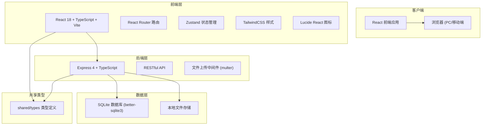
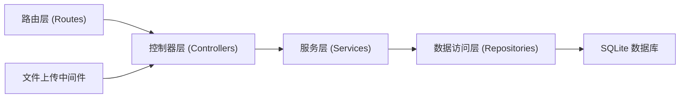
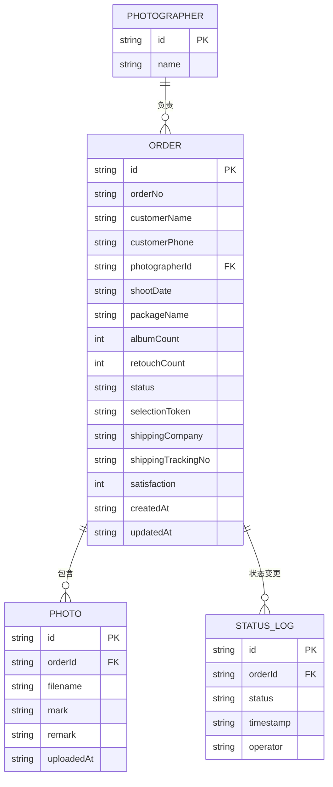

## 1. 架构设计



## 2. 技术说明

- **前端**: React@18 + TypeScript + Vite
- **前端框架附加**: react-router-dom@6（路由）、zustand@4（状态管理）、tailwindcss@3（样式）、lucide-react（图标）
- **初始化工具**: vite-init react-express-ts 模板
- **后端**: Express@4 + TypeScript + ESM
- **数据库**: SQLite（通过 better-sqlite3，嵌入式，零配置，适合小型工作室单机部署）
- **文件上传**: multer 处理照片批量上传，本地文件系统存储
- **Mock 数据**: 内置示例订单数据用于演示

## 3. 路由定义

### 前端路由

| 路由 | 用途 |
|------|------|
| / | 工作台首页，数据概览 + 快捷入口 |
| /orders | 订单列表页，所有订单展示与筛选 |
| /orders/new | 新建订单，录入客户信息 + 照片上传 |
| /orders/:id | 订单详情，含选片确认单 + 制作进度 |
| /select/:token | 客户选片页（无需登录，通过 token 访问 |
| /query | 客服进度查询页 |
| /statistics | 统计报表页 |

### 后端 API 路由

| 方法 | 路由 | 用途 |
|------|------|------|
| GET | /api/orders | 获取订单列表（支持筛选） |
| POST | /api/orders | 创建新订单 |
| GET | /api/orders/:id | 获取订单详情 |
| POST | /api/orders/:id/photos | 批量上传照片 |
| DELETE | /api/orders/:id/photos/:photoId | 删除单张照片 |
| GET | /api/orders/:id/selection-link | 生成/获取选片链接 |
| GET | /api/selection/:token | 通过 token 获取选片数据 |
| POST | /api/selection/:token | 提交客户选片结果 |
| GET | /api/orders/:id/confirmation | 获取选片确认单数据 |
| PATCH | /api/orders/:id/status | 更新订单制作状态 |
| GET | /api/query | 按关键词搜索订单进度 |
| GET | /api/statistics | 获取摄影顾问业绩统计 |
| GET | /api/photos/:filename | 获取照片文件 |

## 4. API 类型定义

```typescript
// 订单状态枚举
type OrderStatus = 'pending_selection' | 'selecting' | 'selected' | 'retouching' | 'layouting' | 'producing' | 'shipping' | 'completed';

// 照片选择标记
type PhotoMark = 'album' | 'retouch' | 'none';

// 摄影顾问
interface Photographer = {
  id: string;
  name: string;
};

// 客户信息
interface Customer {
  name: string;
  phone: string;
}

// 套餐信息
interface PackageInfo {
  name: string;
  albumCount: number;
  retouchCount: number;
}

// 照片
interface Photo {
  id: string;
  orderId: string;
  filename: string;
  url: string;
  mark: PhotoMark | null;
  remark: string | null;
  uploadedAt: string;
}

// 状态变更记录
interface StatusLog {
  status: OrderStatus;
  timestamp: string;
  operator?: string;
}

// 物流信息
interface ShippingInfo {
  company: string;
  trackingNo: string;
}

// 订单
interface Order {
  id: string;
  orderNo: string;
  customer: Customer;
  photographerId: string;
  shootDate: string;
  packageInfo: PackageInfo;
  status: OrderStatus;
  selectionToken: string;
  photos: Photo[];
  statusHistory: StatusLog[];
  shipping?: ShippingInfo;
  satisfaction?: number;
  createdAt: string;
  updatedAt: string;
}

// 统计数据
interface PhotographerStats {
  photographerId: string;
  photographerName: string;
  totalPhotos: number;
  retouchPhotos: number;
  avgSatisfaction: number;
  orderCount: number;
}
```

## 5. 后端服务架构



## 6. 数据模型

### 6.1 ER 图



### 6.2 数据库初始化 DDL

```sql
-- 摄影顾问表
CREATE TABLE IF NOT EXISTS photographers (
    id TEXT PRIMARY KEY,
    name TEXT NOT NULL
);

-- 订单表
CREATE TABLE IF NOT EXISTS orders (
    id TEXT PRIMARY KEY,
    order_no TEXT NOT NULL UNIQUE,
    customer_name TEXT NOT NULL,
    customer_phone TEXT NOT NULL,
    photographer_id TEXT NOT NULL,
    shoot_date TEXT NOT NULL,
    package_name TEXT NOT NULL,
    album_count INTEGER NOT NULL DEFAULT 0,
    retouch_count INTEGER NOT NULL DEFAULT 0,
    status TEXT NOT NULL DEFAULT 'pending_selection',
    selection_token TEXT NOT NULL UNIQUE,
    shipping_company TEXT,
    shipping_tracking_no TEXT,
    satisfaction INTEGER,
    created_at TEXT NOT NULL,
    updated_at TEXT NOT NULL,
    FOREIGN KEY (photographer_id) REFERENCES photographers(id)
);

-- 照片表
CREATE TABLE IF NOT EXISTS photos (
    id TEXT PRIMARY KEY,
    order_id TEXT NOT NULL,
    filename TEXT NOT NULL,
    mark TEXT,
    remark TEXT,
    uploaded_at TEXT NOT NULL,
    FOREIGN KEY (order_id) REFERENCES orders(id)
);

-- 状态变更记录表
CREATE TABLE IF NOT EXISTS status_logs (
    id TEXT PRIMARY KEY,
    order_id TEXT NOT NULL,
    status TEXT NOT NULL,
    timestamp TEXT NOT NULL,
    operator TEXT,
    FOREIGN KEY (order_id) REFERENCES orders(id)
);

-- 创建索引
CREATE INDEX IF NOT EXISTS idx_orders_status ON orders(status);
CREATE INDEX IF NOT EXISTS idx_orders_photographer ON orders(photographer_id);
CREATE INDEX IF NOT EXISTS idx_photos_order ON photos(order_id);
CREATE INDEX IF NOT EXISTS idx_status_logs_order ON status_logs(order_id);
CREATE INDEX IF NOT EXISTS idx_orders_token ON orders(selection_token);

-- 初始化摄影顾问数据
INSERT INTO photographers (id, name) VALUES
    ('p1', '李明辉'),
    ('p2', '王小雅'),
    ('p3', '张艺凡')
ON CONFLICT DO NOTHING;
```
